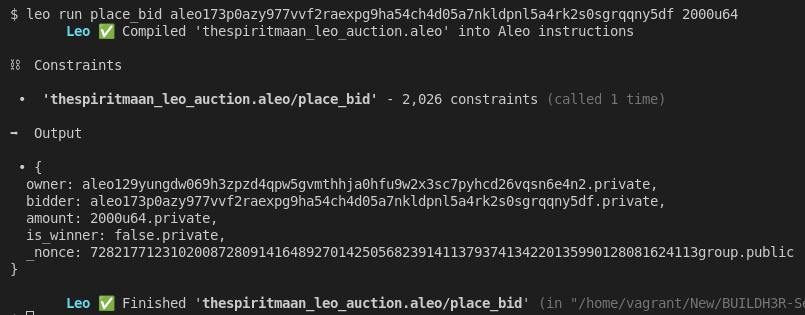
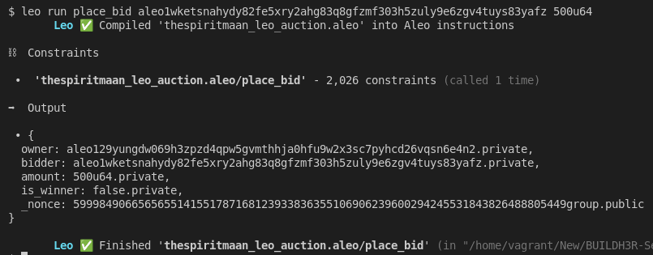
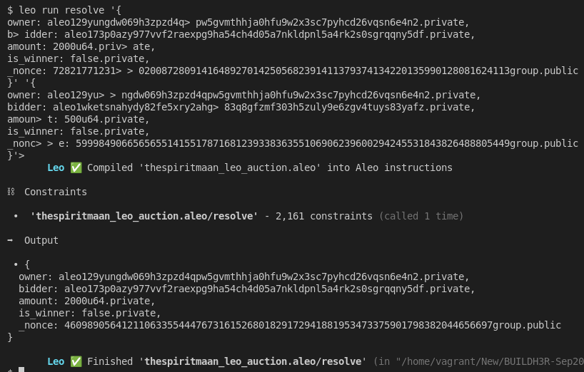
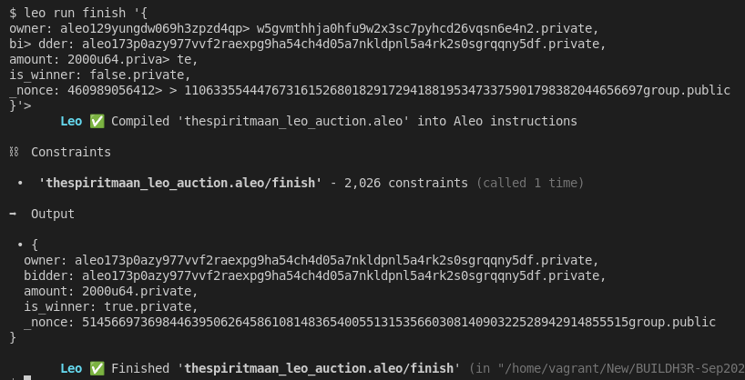
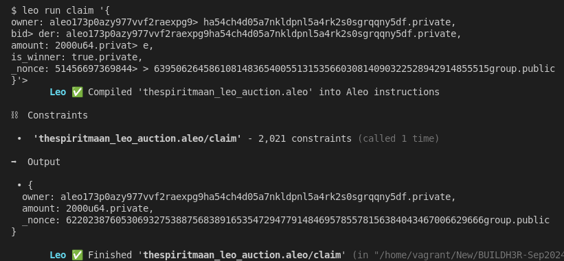
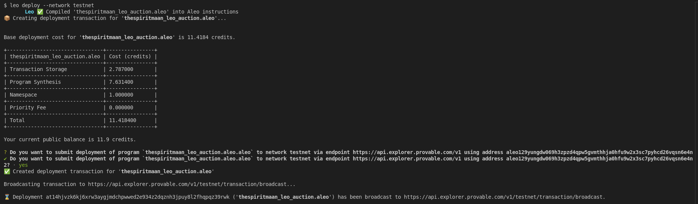
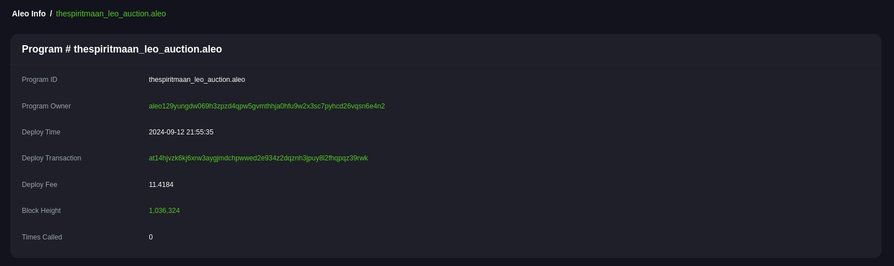

# BUILDH3R Sept Leo

## System Setup
-  Install `rust` locally. Below command will install cli. [More deatils](https://www.rust-lang.org/tools/install)
    ```sh
    curl --proto '=https' --tlsv1.2 -sSf https://sh.rustup.rs | sh
    ```

- Install `leo`. [More Details](https://github.com/ProvableHQ/leo/):
    ```sh
    # Download the source code
    git clone https://github.com/ProvableHQ/leo/
    cd leo
    git checkout testnet-beta
    cargo install --path .
    ```

- Install `SnarkOS`. [More Details](https://github.com/ProvableHQ/snarkOS):
    ```sh
    git clone https://github.com/AleoHQ/snarkOS.git --depth 1
    cd snarkOS
    git checkout testnet-beta
    ./build_ubuntu.sh
    cargo install --path .
    ```

- Install SnarkVM. [More Details](https://github.com/ProvableHQ/snarkVM):
    ```sh
    cargo install snarkvm
    ```

- Make sure all the binaries are added in PATH.

## Create Aleo Project
### Create new project:
- Command:
    ```sh
    leo new thespiritmaan_leo_auction
    ```

- Since, we are trying to create an auction app, there must be bidder and owner. So let's create 2 bidder account and 1 owner.
- Command:
    ```sh
    snarkos account new
    ```
- So, run above command 3 times in terminal:
    <details><summary> Detailed Output </summary><blockquote>

    ~~~
    $ snarkos account new

    Private Key  <redacted>
        View Key  <redacted>
        Address  aleo129yungdw069h3zpzd4qpw5gvmthhja0hfu9w2x3sc7pyhcd26vqsn6e4n2

    $ snarkos account new

    Private Key  <redacted>
        View Key  <redacted>
        Address  aleo173p0azy977vvf2raexpg9ha54ch4d05a7nkldpnl5a4rk2s0sgrqqny5df

    $ snarkos account new

    Private Key  <redacted>
        View Key  <redacted>
        Address  aleo1wketsnahydy82fe5xry2ahg83q8gfzmf303h5zuly9e6zgv4tuys83yafz
    ~~~
    
    </blockquote></details>

- In above image, suppose 1 a/c with Address `aleo129yungdw069h3zpzd4qpw5gvmthhja0hfu9w2x3sc7pyhcd26vqsn6e4n2` is owner and remaining 2nd and 3rd a/cs are bidders. 

- Modify `auction/src/main.leo`. Do not forget to replace owner address in `main.leo` file.

- `.env` is created during the creation of the project. By default, it contains:
    ```sh
    NETWORK=testnet
    PRIVATE_KEY=APrivateKey1zkp8CZNn3yeCseEtxuVPbDCwSyhGW6yZKUYKfgXmcpoGPWH
    ENDPOINT=https://api.explorer.aleo.org/v1
    ```

- Value of Endpoint must be changed with: `https://api.explorer.provable.com/v1`
- New `.env`:
    ```sh
    NETWORK=testnet
    PRIVATE_KEY=APrivateKey1zkp8CZNn3yeCseEtxuVPbDCwSyhGW6yZKUYKfgXmcpoGPWH
    ENDPOINT=https://api.explorer.provable.com/v1
    ```

### Run Test
#### 1st Bid:
- Now, the value of `PRIVATE_KEY` in `.env` must be replaced with the `PRIVATE_KEY` of the 1st bidder.
- Run `place_bid` transaction:
    - Code Snippet:
        ```sh
        leo run place_bid <Address> <Amount>
        ```
    
    - Command:
        ```sh
        leo run place_bid aleo173p0azy977vvf2raexpg9ha54ch4d05a7nkldpnl5a4rk2s0sgrqqny5df 2000u64
        ```
        <details><summary> Detailed Output </summary><blockquote>

        ~~~
        $ leo run place_bid aleo173p0azy977vvf2raexpg9ha54ch4d05a7nkldpnl5a4rk2s0sgrqqny5df 2000u64
            Leo ✅ Compiled 'thespiritmaan_leo_auction.aleo' into Aleo instructions

        ⛓  Constraints

        •  'thespiritmaan_leo_auction.aleo/place_bid' - 2,026 constraints (called 1 time)

        ➡️  Output

        • {
        owner: aleo129yungdw069h3zpzd4qpw5gvmthhja0hfu9w2x3sc7pyhcd26vqsn6e4n2.private,
        bidder: aleo173p0azy977vvf2raexpg9ha54ch4d05a7nkldpnl5a4rk2s0sgrqqny5df.private,
        amount: 2000u64.private,
        is_winner: false.private,
        _nonce: 7282177123102008728091416489270142505682391411379374134220135990128081624113group.public
        }

            Leo ✅ Finished 'thespiritmaan_leo_auction.aleo/place_bid'
        ~~~

        </blockquote></details>
       
        
        
#### 2nd Bid:
- Now, the value of `PRIVATE_KEY` in `.env` must be replaced with the `PRIVATE_KEY` of the 2nd bidder.
- Run `place_bid` transaction:
    - Code Snippet:
        ```sh
        leo run place_bid <Address> <Amount>
        ```
    
    - Command:
        ```sh
        leo run place_bid aleo1wketsnahydy82fe5xry2ahg83q8gfzmf303h5zuly9e6zgv4tuys83yafz 500u64
        ```
        <details><summary> Detailed Output </summary><blockquote>

        ~~~
        $ leo run place_bid aleo1wketsnahydy82fe5xry2ahg83q8gfzmf303h5zuly9e6zgv4tuys83yafz 500u64
            Leo ✅ Compiled 'thespiritmaan_leo_auction.aleo' into Aleo instructions

        ⛓  Constraints

        •  'thespiritmaan_leo_auction.aleo/place_bid' - 2,026 constraints (called 1 time)

        ➡️  Output

        • {
        owner: aleo129yungdw069h3zpzd4qpw5gvmthhja0hfu9w2x3sc7pyhcd26vqsn6e4n2.private,
        bidder: aleo1wketsnahydy82fe5xry2ahg83q8gfzmf303h5zuly9e6zgv4tuys83yafz.private,
        amount: 500u64.private,
        is_winner: false.private,
        _nonce: 5999849066565655141551787168123933836355106906239600294245531843826488805449group.public
        }

            Leo ✅ Finished 'thespiritmaan_leo_auction.aleo/place_bid'
        ~~~

        </blockquote></details>
       
        

#### Resolve Time:
- Since, both the bidder has succesfully bidded, it is the time of owner to resolve who wins the bid.
- Now, the value of `PRIVATE_KEY` in `.env` must be replaced with the `PRIVATE_KEY` of the owner.
- Run `resolve` transaction:
    - Code Snippet:
        ```sh
        leo run resolve <Output_Of_1st_Bid> <Output_Of_2nd_Bid>
        ```
    
    - Command:
        ```sh
        leo run resolve '{
        owner: aleo129yungdw069h3zpzd4qpw5gvmthhja0hfu9w2x3sc7pyhcd26vqsn6e4n2.private,
        bidder: aleo173p0azy977vvf2raexpg9ha54ch4d05a7nkldpnl5a4rk2s0sgrqqny5df.private,
        amount: 2000u64.private,
        is_winner: false.private,
        _nonce: 7282177123102008728091416489270142505682391411379374134220135990128081624113group.public
        }' '{
        owner: aleo129yungdw069h3zpzd4qpw5gvmthhja0hfu9w2x3sc7pyhcd26vqsn6e4n2.private,
        bidder: aleo1wketsnahydy82fe5xry2ahg83q8gfzmf303h5zuly9e6zgv4tuys83yafz.private,
        amount: 500u64.private,
        is_winner: false.private,
        _nonce: 5999849066565655141551787168123933836355106906239600294245531843826488805449group.public
        }'
        ```
        <details><summary> Detailed Output </summary><blockquote>

        ~~~
        $ leo run resolve '{
        owner: aleo129yungdw069h3zpzd4q> pw5gvmthhja0hfu9w2x3sc7pyhcd26vqsn6e4n2.private,
        b> idder: aleo173p0azy977vvf2raexpg9ha54ch4d05a7nkldpnl5a4rk2s0sgrqqny5df.private,
        amount: 2000u64.priv> ate,
        is_winner: false.private,
        _nonce: 72821771231> > 02008728091416489270142505682391411379374134220135990128081624113group.public
        }' '{
        owner: aleo129yu> > ngdw069h3zpzd4qpw5gvmthhja0hfu9w2x3sc7pyhcd26vqsn6e4n2.private,
        bidder: aleo1wketsnahydy82fe5xry2ahg> 83q8gfzmf303h5zuly9e6zgv4tuys83yafz.private,
        amoun> t: 500u64.private,
        is_winner: false.private,
        _nonc> > e: 5999849066565655141551787168123933836355106906239600294245531843826488805449group.public
        }'> 
            Leo ✅ Compiled 'thespiritmaan_leo_auction.aleo' into Aleo instructions

        ⛓  Constraints

        •  'thespiritmaan_leo_auction.aleo/resolve' - 2,161 constraints (called 1 time)

        ➡️  Output

        • {
        owner: aleo129yungdw069h3zpzd4qpw5gvmthhja0hfu9w2x3sc7pyhcd26vqsn6e4n2.private,
        bidder: aleo173p0azy977vvf2raexpg9ha54ch4d05a7nkldpnl5a4rk2s0sgrqqny5df.private,
        amount: 2000u64.private,
        is_winner: false.private,
        _nonce: 460989056412110633554447673161526801829172941881953473375901798382044656697group.public
        }

            Leo ✅ Finished 'thespiritmaan_leo_auction.aleo/resolve'
        ~~~

        </blockquote></details>
       
        

#### Finish Bid:
- Keep same `.env` as we are running as owner.
- Run `finish` transaction:
    - Code Snippet:
        ```sh
        leo run finish <Resolve_Bid>
        ```
    
    - Command:
        ```sh
        leo run finish '{
        owner: aleo129yungdw069h3zpzd4qpw5gvmthhja0hfu9w2x3sc7pyhcd26vqsn6e4n2.private,
        bidder: aleo173p0azy977vvf2raexpg9ha54ch4d05a7nkldpnl5a4rk2s0sgrqqny5df.private,
        amount: 2000u64.private,
        is_winner: false.private,
        _nonce: 460989056412110633554447673161526801829172941881953473375901798382044656697group.public
        }'
        ```
        <details><summary> Detailed Output </summary><blockquote>

        ~~~
        $ leo run finish '{
        owner: aleo129yungdw069h3zpzd4qp> w5gvmthhja0hfu9w2x3sc7pyhcd26vqsn6e4n2.private,
        bi> dder: aleo173p0azy977vvf2raexpg9ha54ch4d05a7nkldpnl5a4rk2s0sgrqqny5df.private,
        amount: 2000u64.priva> te,
        is_winner: false.private,
        _nonce: 460989056412> > 110633554447673161526801829172941881953473375901798382044656697group.public
        }'> 
            Leo ✅ Compiled 'thespiritmaan_leo_auction.aleo' into Aleo instructions

        ⛓  Constraints

        •  'thespiritmaan_leo_auction.aleo/finish' - 2,026 constraints (called 1 time)

        ➡️  Output

        • {
        owner: aleo173p0azy977vvf2raexpg9ha54ch4d05a7nkldpnl5a4rk2s0sgrqqny5df.private,
        bidder: aleo173p0azy977vvf2raexpg9ha54ch4d05a7nkldpnl5a4rk2s0sgrqqny5df.private,
        amount: 2000u64.private,
        is_winner: true.private,
        _nonce: 514566973698446395062645861081483654005513153566030814090322528942914855515group.public
        }

            Leo ✅ Finished 'thespiritmaan_leo_auction.aleo/finish'
        ~~~

        </blockquote></details>
       
        

    - According to above outputs, a/c with `Address`: `aleo173p0azy977vvf2raexpg9ha54ch4d05a7nkldpnl5a4rk2s0sgrqqny5df` is the winner and is new owner.

#### Claim Bid:
- Now, the value of `PRIVATE_KEY` in `.env` must be replaced with the `PRIVATE_KEY` of the owner `aleo173p0azy977vvf2raexpg9ha54ch4d05a7nkldpnl5a4rk2s0sgrqqny5df`.
- Run `claim` transaction:
    - Code Snippet:
        ```sh
        leo run claim <Finish_Bid>
        ```
    
    - Command:
        ```sh
        leo run claim '{
        owner: aleo173p0azy977vvf2raexpg9ha54ch4d05a7nkldpnl5a4rk2s0sgrqqny5df.private,
        bidder: aleo173p0azy977vvf2raexpg9ha54ch4d05a7nkldpnl5a4rk2s0sgrqqny5df.private,
        amount: 2000u64.private,
        is_winner: true.private,
        _nonce: 514566973698446395062645861081483654005513153566030814090322528942914855515group.public
        }'
        ```
        <details><summary> Detailed Output </summary><blockquote>

        ~~~
        $ leo run claim '{
        owner: aleo173p0azy977vvf2raexpg9> ha54ch4d05a7nkldpnl5a4rk2s0sgrqqny5df.private,
        bid> der: aleo173p0azy977vvf2raexpg9ha54ch4d05a7nkldpnl5a4rk2s0sgrqqny5df.private,
        amount: 2000u64.privat> e,
        is_winner: true.private,
        _nonce: 51456697369844> > 6395062645861081483654005513153566030814090322528942914855515group.public
        }'> 
            Leo ✅ Compiled 'thespiritmaan_leo_auction.aleo' into Aleo instructions

        ⛓  Constraints

        •  'thespiritmaan_leo_auction.aleo/claim' - 2,021 constraints (called 1 time)

        ➡️  Output

        • {
        owner: aleo173p0azy977vvf2raexpg9ha54ch4d05a7nkldpnl5a4rk2s0sgrqqny5df.private,
        amount: 2000u64.private,
        _nonce: 6220238760530693275388756838916535472947791484695785578156384043467006629666group.public
        }

            Leo ✅ Finished 'thespiritmaan_leo_auction.aleo/claim'
        ~~~

        </blockquote></details>
       
        

#### Deploy To Testnet:
- Command:
    ```sh
    leo deploy --network testnet
    ```


    <details><summary> Detailed Output </summary><blockquote>

    ~~~
    $ leo deploy --network testnet
        Leo ✅ Compiled 'thespiritmaan_leo_auction.aleo' into Aleo instructions
    📦 Creating deployment transaction for 'thespiritmaan_leo_auction.aleo'...


    Base deployment cost for 'thespiritmaan_leo_auction.aleo' is 11.4184 credits.

    +--------------------------------+----------------+
    | thespiritmaan_leo_auction.aleo | Cost (credits) |
    +--------------------------------+----------------+
    | Transaction Storage            | 2.787000       |
    +--------------------------------+----------------+
    | Program Synthesis              | 7.631400       |
    +--------------------------------+----------------+
    | Namespace                      | 1.000000       |
    +--------------------------------+----------------+
    | Priority Fee                   | 0.000000       |
    +--------------------------------+----------------+
    | Total                          | 11.418400      |
    +--------------------------------+----------------+

    Your current public balance is 11.9 credits.

    ? Do you want to submit deployment of program `thespiritmaan_leo_auction.aleo.aleo` to network testnet via endpoint https://api.explorer.provable.com/v1 using address aleo129yungdw069h3zpzd4qpw5gvmthhja0hfu9w2x3sc7pyhcd26vqsn6e4n
    ✔ Do you want to submit deployment of program `thespiritmaan_leo_auction.aleo.aleo` to network testnet via endpoint https://api.explorer.provable.com/v1 using address aleo129yungdw069h3zpzd4qpw5gvmthhja0hfu9w2x3sc7pyhcd26vqsn6e4n2? · yes
    ✅ Created deployment transaction for 'thespiritmaan_leo_auction.aleo'

    Broadcasting transaction to https://api.explorer.provable.com/v1/testnet/transaction/broadcast...

    ⌛ Deployment at14hjvzk6kj6xrw3aygjmdchpwwed2e934z2dqznh3jpuy8l2fhqpqz39rwk ('thespiritmaan_leo_auction.aleo') has been broadcast to https://api.explorer.provable.com/v1/testnet/transaction/broadcast.
    ~~~

    </blockquote></details>

    


- Links: 
    - Aleo Program: [https://testnet.aleo.info/program/thespiritmaan_leo_auction.aleo](https://testnet.aleo.info/program/thespiritmaan_leo_auction.aleo)
    - Deploy Txn: [https://testnet.aleo.info/transaction/at14hjvzk6kj6xrw3aygjmdchpwwed2e934z2dqznh3jpuy8l2fhqpqz39rwk](https://testnet.aleo.info/transaction/at14hjvzk6kj6xrw3aygjmdchpwwed2e934z2dqznh3jpuy8l2fhqpqz39rwk) 

    
